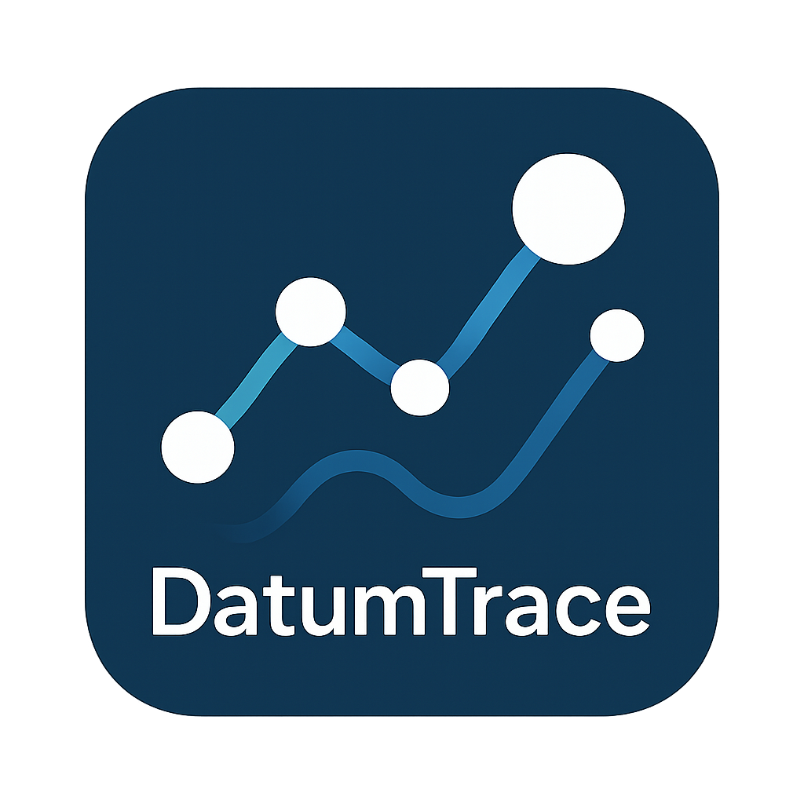

```markdown
# 🛰️ DatumTrace

<p align="center">
  
</p>

**DatumTrace** is a modular, terminal-based **OSINT data scraping framework** that pulls emails, usernames, and social profiles from public sources based on a given **name or domain**.

Designed for privacy researchers, threat hunters, and data investigators — **not a release tool**, but a clean, extendable backend with each module usable as a standalone experiment.

---

## 🔧 Features

- 🕵️ Extracts emails, usernames, and social media profiles from various open web sources.
- 📦 Modular Python + YAML structure for easy expansion.
- 🌐 Cross-language design — uses Python, YAML, Bash (and future plugin options).
- ⚙️ CLI interface only — zero GUI clutter.
- 🧪 Each module is cleanly separable for publishing as standalone “experiments”.

---

## 📁 Project Structure
---

## 🚀 Quick Start

### 1️⃣ Install Dependencies

Requires Python 3.9+

```bash
pip install -r requirements.txt
````

Optional (for some experiments):

```bash
sudo apt install curl jq whois
```

---

### 2️⃣ Run the Scraper

By name:

```bash
python main.py --name "John Doe"
```

By domain:

```bash
python main.py --domain "example.com"
```

---

## ⚙️ CLI Options

| Flag       | Description                     |
| ---------- | ------------------------------- |
| `--name`   | Full name to search             |
| `--domain` | Domain to search                |
| `--output` | Save results to file (optional) |
| `--debug`  | Enable verbose debug logging    |

---

## 🔌 sources.yaml Sample

```yaml
email_sources:
  - name: hunter.io
    url: "https://api.hunter.io/v2/email-finder"
    api_key_required: true

social_sources:
  - name: github
    url_template: "https://github.com/{username}"

username_sources:
  - name: namechk
    url_template: "https://namechk.com/{username}"
```

---

## 🧠 Philosophy

> DatumTrace is **not** a one-click OSINT tool.
> It is a **clean, teachable, extensible backend framework**.

* Each module is minimal, self-contained, and reusable.
* Promotes learning through experimentation.
* Ideal for building out your own plugins or pipelines.

---

## ⚠️ Disclaimer

**DatumTrace is for educational and research purposes only.**
Do not use this for any illegal, unethical, or unauthorized data collection.

We are **not responsible** for how this code is used.

---

## 📜 License

Licensed under the MIT License.

---

## 👥 Credits

* Inspired by: [Photon](https://github.com/s0md3v/Photon), [Sherlock](https://github.com/sherlock-project/sherlock), [SpiderFoot](https://github.com/smicallef/spiderfoot)
* Built with: `requests`, `aiohttp`, `PyYAML`, `BeautifulSoup4`, standard libraries

---

## ⭐ Like the idea?

Star this repo. Fork and build your own modules.
If you make a cool scraper, consider sharing it back as an `experiment`!

---

```

---

### ✅ How it looks:
- 🖼️ Banner is centered and resizes nicely
- 📄 Sections are structured with headings and tables
- 🧪 Experiments and source plugins are well explained
- 🧠 Emphasizes clean modular usage over "ready-to-use" UI tools

Let me know if you want:
- Dark-mode-friendly `datum.png`
- Auto-generated documentation
- GitHub badges (e.g., license, build, Python version)
- A `docs/` folder with deeper usage/tutorial files
```
